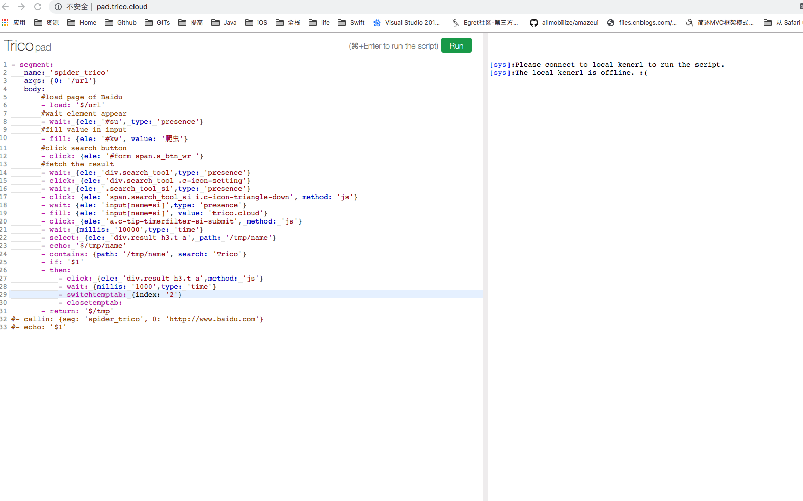

# trico
Trico爬虫云原生，无需发布部署,强大的集群支持和多用户协作管理平台的支撑，可灵活调度任务，顺利爬取海量数据的一套云数据采集平台
### 0基础上手
Trico封装了一套独属于trico的脚本语言,非常简单易上手。打开Trico的官网有相关的使用文档,只需要5步就可以轻松在自己的电脑上进行体验,通过自己电脑抓取一些自己想要的数据。除此之外完成segment提交审核通过后,我们提供一台机器免费的部署,提供免费50次爬取
### 结构自定义
数据结构完全由自己来进行拼接，我们遵循json结构,你可以将需要的数据自由命名按json结构输出。
### 你可以得到什么
现在我们已经支持自定义的接口来获取你爬到的数据，并支持导出成excel的token,如果你想整理某块数据快速导出只需要短短几分钟完成一个segment即可
### trico初体验
进入官网:www.trico.cloud, 点击右上角的安装花费几分钟的时间你就可以在本地部署一个trico,进行初体验了。
### trico的脚本介绍
trico采用了模块化的思路每一个segment就是一个独立模块，可以在里面被调用,如果一个相对复杂的网站,可以通过分模块的方式来实现多人合作，或者持续性完成,通过模块提供的复用性可以对一个网站页面进行多情况的组合。
我们把每一个动作包括load页面,click按钮都称之为token,在官网的文档里我们对所有的token进行了详细的描述,复制内容打开pad,可以开始轻松的尝试.

上图就是我们为了爬虫做的一个调试页面,在这里你可以随意的调试你写的每个segment(需要先安装我们的镜像等待左下角灯变成绿色表示已经成功连接才可以进行使用)。

